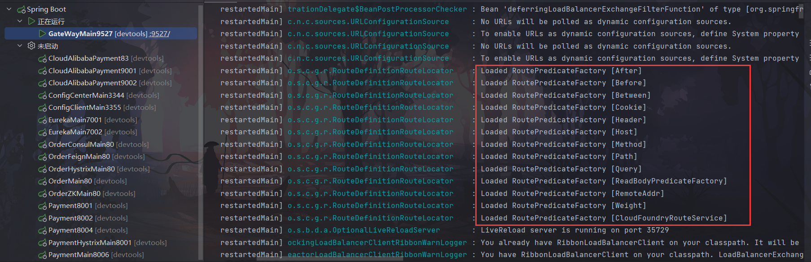

# SpringCloud:

## 微服务概述

1、什么是微服务

- 目前的微服务并没有一个统一的标准，一般是以业务来划分
- 将传统的一站式应用，拆分成一个个的服务，彻底去耦合，一个微服务就是单功能业务，只做一件事。
- 与微服务相对的叫巨石

2、微服务与微服务架构

- 微服务是一种架构模式或者一种架构风格，提倡将单一应用程序划分成一组小的服务独立部署，服务之间相互配合、相互协调，每个服务运行于自己的进程中。
- 服务与服务间采用轻量级通讯，如HTTP的RESTful API等
- 避免统一的、集中式的服务管理机制

3、 微服务的优缺点

优点

1. 每个服务足够内聚，足够小，比较容易聚焦
2. 开发简单且效率高，一个服务只做一件事情
3. 开发团队小，一般2-5人足以（当然按实际为准）
4. 微服务是松耦合的，无论开发还是部署都可以独立完成
5. 微服务能用不同的语言开发
6. 易于和第三方集成，微服务允许容易且灵活的自动集成部署（持续集成工具有Jenkins,Hudson,bamboo等）
7. 微服务易于被开发人员理解，修改和维护，这样可以使小团队更加关注自己的工作成果，而无需一定要通过合作才能体现价值
8. 微服务允许你融合最新的技术
9. 微服务只是业务逻辑的代码，不会和HTML,CSS或其他界面组件融合。
10. 每个微服务都可以有自己的存储能力，数据库可自有也可以统一，十分灵活。

缺点

1. 开发人员要处理分布式系统的复杂性
2. 多服务运维难度，随着服务的增加，运维的压力也会增大
3. 依赖系统部署
4. 服务间通讯的成本
5. 数据的一致性
6. 系统集成测试
7. 性能监控的难度

##  SpringCloud概述

spring的三大模块：SpringBoot（构建），Spring Cloud（协调），Spring Cloud Data Flow（连接）

1、SpringCloud是什么

- 分布式系统的简化版（官方介绍）
- SpringCloud基于SpringBoot提供了一整套微服务的解决方案，包括服务注册与发现，配置中心，全链路监控，服务网关，负载均衡，熔断器等组件，除了基于Netflix的开源组件做高度抽象封装之外，还有一些选型中立的开源组件
- SpringCloud利用SpringBoot的开发便利性巧妙地简化了分布式系统的基础设施开发，SpringCloud为开发人员提供了快速构建分布式系统的一些工具，包括配置管理、服务发现、断路器、路由、微代理、事件总线，全局所、决策精选、分布式会话等等，他们都可以用SpringBoot的开发风格做到一键启动和部署。
- 一句话概括：SpringCloud是分布式微服务架构下的一站式解决方案，是各个微服务架构落地技术的几何体，俗称微服务全家桶

2、SpringCloud和SpringBoot的关系：

- SpringBoot：专注于快速方便的开发单个个体微服务（关注微观）

- SpringCloud：关注全局的微服务协调治理框架，将SpringBoot开发的一个个单体微服务组合并管理起来（关注宏观）


## 1、服务注册与发现

### 1、Eureka

####  介绍

- Eureka是一个基于REST的服务，用于定位服务，以实现云端中间层服务发现和故障转移。
- Eureka主管服务注册与发现，在微服务中，以后了这两者，只需要使用服务的标识符（就是那个在每个服务的yml文件中取得服务名称），就可以访问到服务，不需要修改服务调用的配置文件
- Eureka遵循AP原则（高可用，分区容错性），因为使用了自我保护机制所以保证了高可用

#### 原理

- Eureka使用的是C-S结构（客户端-服务端）
- 两大组件：Eureka Server（提供注册服务）、Eureka Client（JAVA客户端，负责发送心跳）
- 系统中的其他微服务使用Eureka客户端连接到Eureka服务端维持心跳连接（即注册）。SpringCloud的其他模块可以通过Eureka Server 来发现系统中的微服务并加以调用

#### 自我保护机制

介绍：Eureka的自我保护机制主要是为了网络异常时保持高可用设计的，当在Eureka中注册的微服务超过设定是时间内（默认90秒）没有向Eureka服务端发送心跳，该微服务会进入自我保护模式。在自我保护模式中，Eureka会保护服务注册表中的信息，不会注销任何服务实例，直至收到的心跳数恢复至阈值以上，该微服务退出自我保护模式。

理解：好死不如赖活：Eureka的设计哲学是宁可保留错误的服务信息，也不盲目注销可能健康的服务。所以异常的服务不会被注销，而是进入了自我保护模式。

```yaml
eureka:
  server:
    #关闭自我保护机制，保证不可用服务被及时踢除
    enable-self-preservation: false
    # 剔除时间间隔
    eviction-interval-timer-in-ms: 2000
```


### 2、Zookeeper

### 3、Consul

### 4、异同

## 2、服务调用

## 3、服务熔断/降级

一次调用失败为降级，多级调用失败熔断

## 4、服务网关

[官网](https://spring.io/projects/spring-cloud-gateway)

### 1.概述

SpringCloud Gateway使用的是Webflux中的reactor-netty响应式编程组件,底层使用了Netty通讯框架。

#### 1.1 特性

- 动态路由：能够匹配任何请求属性
-  Predicate（断言）和 Filter（过滤器）
- 集成Hystrix的断路器功能
- 集成 Spring Cloud 服务发现功能
- 请求限流功能
- 支持路径重写

#### 1.2 三大核心概念

**Route(路由)**

路由是构建网关的基本模块，它由ID，目标URI，一系列的断言和过滤器组成，如果断言为true则匹配该路由

**Predicate(断言)**

参考的是Java8的java.util.function.Predicate，开发人员可以匹配HTTP请求中的所有内容(例如请求头或请求参数)，如果请求与断言相匹配则进行路由

**Filter(过滤)**

指的是Spring框架中GatewayFilter的实例，使用过滤器，可以在请求被路由前或者之后对请求进行修改。


### 2.工作流程


> Clients make requests to Spring Cloud Gateway. If the Gateway Handler Mapping determines that a request matches a route, it is sent to the Gateway Web Handler. This handler runs the request through a filter chain that is specific to the request. The reason the filters are divided by the dotted line is that filters can run logic both before and after the proxy request is sent. All “pre” filter logic is executed. Then the proxy request is made. After the proxy request is made, the “post” filter logic is run.

客户端向 Spring Cloud Gateway 发出请求。然后在 Gateway Handler Mapping 中找到与请求相匹配的路由，将其发送到 Gateway Web Handler。

### 4.配置

#### 4.1 pom

```xml
<dependencies>
        <!--gateway-->
        <dependency>
            <groupId>org.springframework.cloud</groupId>
            <artifactId>spring-cloud-starter-gateway</artifactId>
        </dependency>
        <!--eureka-client-->
        <dependency>
            <groupId>org.springframework.cloud</groupId>
            <artifactId>spring-cloud-starter-netflix-eureka-client</artifactId>
        </dependency>
</dependencies>
```


#### 4.2 yaml 配置方式

```yaml
server:
  port: 9527

spring:
  application:
    name: cloud-gateway
  cloud:
    gateway:
      routes:
        - id: payment_routh #payment_route    #路由的ID，没有固定规则但要求唯一，建议配合服务名
          uri: http://localhost:8001          #匹配后提供服务的路由地址
          predicates:
            - Path=/payment/get/**         # 断言，路径相匹配的进行路由

        - id: payment_routh2 #payment_route    #路由的ID，没有固定规则但要求唯一，建议配合服务名
          uri: http://localhost:8001          #匹配后提供服务的路由地址
          predicates:
            - Path=/payment/lb/**         # 断言，路径相匹配的进行路由

eureka:
  instance:
    hostname: cloud-gateway-service
  client: #服务提供者provider注册进eureka服务列表内
    service-url:
      register-with-eureka: true
      fetch-registry: true
      defaultZone: http://eureka7001.com:7001/eureka,http://eureka7002.com:7002/eureka
      #defaultZone: http://eureka7001.com:7001/eureka
```

#### 4.4 主启动类

```java
@SpringBootApplication
@EnableEurekaClient
public class GateWayMain9527 {
    public static void main(String[] args) {
        SpringApplication.run(GateWayMain9527.class, args);
    }
}

```


#### 4.3 代码配置方式

```java
@Configuration
public class GateWayConfig {
    @Bean
    public RouteLocator customRouteLocator(RouteLocatorBuilder routeLocatorBuilder) {
        RouteLocatorBuilder.Builder routes = routeLocatorBuilder.routes();
        routes.route("path_route_atguigu", r -> r.path("/guoji").uri("http://news.baidu.com/guonei"))
                .build();
        return routes.build();
    }
}
```

官网案例：

```java
//https://spring.io/projects/spring-cloud-gateway#overview
@SpringBootApplication
public class DemogatewayApplication {
	@Bean
	public RouteLocator customRouteLocator(RouteLocatorBuilder builder) {
		return builder.routes()
			.route("path_route", r -> r.path("/get")
				.uri("http://httpbin.org"))
			.route("host_route", r -> r.host("*.myhost.org")
				.uri("http://httpbin.org"))
			.route("rewrite_route", r -> r.host("*.rewrite.org")
				.filters(f -> f.rewritePath("/foo/(?<segment>.*)", "/${segment}"))
				.uri("http://httpbin.org"))
			.route("hystrix_route", r -> r.host("*.hystrix.org")
				.filters(f -> f.hystrix(c -> c.setName("slowcmd")))
				.uri("http://httpbin.org"))
			.route("hystrix_fallback_route", r -> r.host("*.hystrixfallback.org")
				.filters(f -> f.hystrix(c -> c.setName("slowcmd").setFallbackUri("forward:/hystrixfallback")))
				.uri("http://httpbin.org"))
			.route("limit_route", r -> r
				.host("*.limited.org").and().path("/anything/**")
				.filters(f -> f.requestRateLimiter(c -> c.setRateLimiter(redisRateLimiter())))
				.uri("http://httpbin.org"))
			.build();
	}
}
```

### 5.服务名实现动态路由

pom添加eureka-client

修改yaml文件

```yaml
server:
  port: 9527

spring:
  application:
    name: cloud-gateway
  cloud:
    gateway:
      discovery:
        locator:
          enabled: true #开启从注册中心动态创建路由的功能，利用微服务名进行路由
      routes:
        - id: payment_routh #payment_route    #路由的ID，没有固定规则但要求唯一，建议配合服务名
          #uri: http://localhost:8001          #匹配后提供服务的路由地址
          uri: lb://cloud-payment-service #匹配后提供服务的路由地址
          predicates:
            - Path=/payment/get/**         # 断言，路径相匹配的进行路由
            - After=2022-08-10T13:45:24.311+08:00[Asia/Shanghai]

        - id: payment_routh2 #payment_route    #路由的ID，没有固定规则但要求唯一，建议配合服务名
          #uri: http://localhost:8001          #匹配后提供服务的路由地址
          uri: lb://cloud-payment-service #匹配后提供服务的路由地址
          predicates:
            - Path=/payment/lb/**         # 断言，路径相匹配的进行路由
            - After=2022-08-10T13:45:24.311+08:00[Asia/Shanghai]
            # - Before=2022-08-10T14:45:24.311+08:00[Asia/Shanghai]
            # - Between=2022-08-10T14:45:24.311+08:00[Asia/Shanghai] ,  2022-08-10T14:45:24.311+08:00[Asia/Shanghai]
            # - Cookie=username,zzyy   #Cookie=cookieName,正则表达式
            # - 请求头要有X-Request-Id属性并且值为整数的正则表达式 curl http://localhost:9527/payment/lb --cookie "username=zzyy" -H "X-Request-Id:11"
            # - Header=X-Request-Id, \d+
            # - Host=**.atguigu.com  # curl http://localhost:9527/payment/lb -H "Host:afae.atguigu.com"

eureka:
  instance:
    hostname: cloud-gateway-service
  client: #服务提供者provider注册进eureka服务列表内
    service-url:
      register-with-eureka: true
      fetch-registry: true
      defaultZone: http://eureka7001.com:7001/eureka,http://eureka7002.com:7002/eureka
      #defaultZone: http://eureka7001.com:7001/eureka
```

uri的协议为lb，表示启用Gateway的负载均衡功能。lb://serviceName是spring cloud gateway在微服务中自动为我们创建的负载均衡uri。

### 6.Predicate

[Spring Cloud Gateway中文文档](https://springdoc.cn/spring-cloud-gateway/#gateway-request-predicates-factories)



#### 6.1 After

`After` 路由谓词工厂需要一个参数，即一个日期时间（这是一个java `ZonedDateTime`）。这个谓词匹配发生在指定日期时间之后的请求。下面的例子配置了一个After路由谓词。

```yaml
spring:
  cloud:
    gateway:
      routes:
      - id: after_route
        uri: https://example.org
        predicates:
        - After=2017-01-20T17:42:47.789-07:00[America/Denver]
```

该路由与北美山区时间（丹佛）2017年1月20日17:42之后发出的任何请求相匹配。

#### 6.2 Before

`Before` 路由谓词工厂只需要一个参数，即 `datetime`（这是一个java `ZonedDateTime`）。这个谓词匹配发生在指定 `datetime` 之前的请求。下面的例子配置了一个Before路由谓词。

```yaml
spring:
  cloud:
    gateway:
      routes:
      - id: before_route
        uri: https://example.org
        predicates:
        - Before=2017-01-20T17:42:47.789-07:00[America/Denver]
```

该路由与北美山区时间2017年1月20日17:42（丹佛）之前发出的任何请求相匹配。

#### 6.3 Between

`Between` 路由谓词工厂需要两个参数，`datetime1` 和 `datetime2`，它们是java `ZonedDateTime` 对象。这个谓词匹配发生在 `datetime1` 之后和 `datetime2` 之前的请求。`datetime2` 的参数必须在 `datetime1` 之后。下面的例子配置了一个 between 路由谓词。

```yaml
spring:
  cloud:
    gateway:
      routes:
      - id: between_route
        uri: https://example.org
        predicates:
        - Between=2017-01-20T17:42:47.789-07:00[America/Denver], 2017-01-21T17:42:47.789-07:00[America/Denver]

```

这个路由匹配2017年1月20日山区时间（丹佛）17:42之后和2017年1月21日山区时间（丹佛）17:42之前的任何请求。这对维护窗口可能是有用的。

#### 6.4 Cookie

`Cookie` 路由谓词工厂接受两个参数，即 cookie `name` 和一个 `regexp`（这是一个Java正则表达式）。这个谓词匹配具有给定名称且其值符合正则表达式的cookie。下面的例子配置了一个cookie路由谓词工厂。

```yaml
spring:
  cloud:
    gateway:
      routes:
      - id: cookie_route
        uri: https://example.org
        predicates:
        - Cookie=chocolate, ch.p
```

这个路由匹配有一个名为 `chocolate` 的cookie，其值符合 `ch.p` 正则表达式的请求。

#### 6.5 Header

`Header` 路由谓词工厂需要两个参数，`header` 和一个 `regexp`（这是一个Java正则表达式）。这个谓词与具有给定名称且其值与正则表达式相匹配的 header 匹配。下面的例子配置了一个 header 路由谓词。

```yaml
spring:
  cloud:
    gateway:
      routes:
      - id: header_route
        uri: https://example.org
        predicates:
        - Header=X-Request-Id, \d+

```

如果请求有一个名为 `X-Request-Id` 的header，其值与 `\d+` 正则表达式相匹配（也就是说，它的值是一个或多个数字），则该路由匹配。

#### 6.6 Host

`Host` 路由谓语工厂接受一个参数：一个主机（Host）名称的 `patterns` 列表。该pattern是Ant风格的模式，以 `.` 为分隔符。这个谓词匹配符合该pattern的Host header。下面的例子配置了一个 host 路由谓词。

```yaml
spring:
  cloud:
    gateway:
      routes:
      - id: host_route
        uri: https://example.org
        predicates:
        - Host=**.somehost.org,**.anotherhost.org

```

支持URI模板变量（如 `{sub}.myhost.org`）。

如果请求的 `Host` header的值为 `www.somehost.org` 或 `beta.somehost.org` 或 `www.anotherhost.org`，则该路由匹配。

这个谓词提取URI模板变量（比如前面例子中定义的 `sub`）作为名称和值的映射，并将其放在 `ServerWebExchange.getAttributes()` 中，key值定义在 `ServerWebExchangeUtils.URI_TEMPLATE_VARIABLES_ATTRIBUTE`。然后这些值就可以被 [`GatewayFilter` 工厂](https://springdoc.cn/spring-cloud-gateway/#gateway-route-filters)使用了

#### 6.7 Method

`Method` 路由谓词工厂接受一个 `methods` 参数，它是一个或多个参数：要匹配的HTTP方法。下面的例子配置了一个 method 路由谓词。

```yaml
spring:
  cloud:
    gateway:
      routes:
      - id: method_route
        uri: https://example.org
        predicates:
        - Method=GET,POST

```

如果请求方式是 `GET` 或 `POST`，则该路由匹配。

#### 6.8 Path

`Path` 路由谓词工厂需要两个参数：一个Spring `PathMatcher` `patterns` 的list和一个可选的flag `matchTrailingSlash`（默认为 `true`）。下面的例子配置了一个path路由谓词。

```yaml
spring:
  cloud:
    gateway:
      routes:
      - id: path_route
        uri: https://example.org
        predicates:
        - Path=/red/{segment},/blue/{segment}

```

如果请求路径是 `/red/1` 或 `/red/1/` 或 `/red/blue` 或 `/blue/green`，则该路由匹配。

如果 `matchTrailingSlash` 被设置为 `false`，那么请求路径 `/red/1/` 将不会被匹配。

这个谓词提取URI模板变量（比如前面例子中定义的 `segment`）作为name和value的映射，并把它放在 `ServerWebExchange.getAttributes()` 中，KEY值定义在 `ServerWebExchangeUtils.URI_TEMPLATE_VARIABLES_ATTRIBUTE`。然后这些值就可以被 [`GatewayFilter` 工厂](https://springdoc.cn/spring-cloud-gateway/#gateway-route-filters)使用了。

有一个实用的方法（称为 `get`），可以使访问这些变量变得更容易。下面的例子显示了如何使用 `get` 方法。

```java
Map<String, String> uriVariables = ServerWebExchangeUtils.getUriTemplateVariables(exchange);

String segment = uriVariables.get("segment");
```

#### 6.9 Query

`Query` 路由谓词工厂需要两个参数：一个必需的 `param` 和一个可选的 `regexp`（这是一个Java正则表达式）。下面的例子配置了一个 query 路由谓词。

```yaml
spring:
  cloud:
    gateway:
      routes:
      - id: query_route
        uri: https://example.org
        predicates:
        - Query=green

```

如果请求包含一个 `green` 的查询参数，前面的路由就会匹配。

```yaml
spring:
  cloud:
    gateway:
      routes:
      - id: query_route
        uri: https://example.org
        predicates:
        - Query=red, gree.

```

如果请求中包含一个 `red` 的查询参数，其值与 `gree.` 表达式相匹配，那么路由就会匹配。例如： `green` 和 `greet` 

#### 6.10 RemoteAddr

`RemoteAddr` 路由谓词工厂接受一个 `sources` 集合（最小长度为1），它是CIDR注解（IPv4或IPv6）字符串，如 `192.168.0.1/16`（其中 `192.168.0.1` 是一个IP地址，`16` 是一个子网掩码）。下面的例子配置了一个RemoteAddr路由谓词。

```yaml
spring:
  cloud:
    gateway:
      routes:
      - id: remoteaddr_route
        uri: https://example.org
        predicates:
        - RemoteAddr=192.168.1.1/24

```

如果请求的远程地址 `192.168.1.10`，则该路由匹配。

##### 6.10.1 修改远程地址（Remote Addresse）的解析方式

默认情况下，RemoteAddr路由谓语工厂使用传入请求中的远程地址。如果Spring Cloud Gateway位于代理层后面，这可能与实际的客户IP地址不一致。

你可以通过设置一个自定义的 `RemoteAddressResolver` 来定制远程地址的解析方式。Spring Cloud Gateway有一个非默认的远程地址解析器，它是基于 [X-Forwarded-For Header](https://developer.mozilla.org/en-US/docs/Web/HTTP/Headers/X-Forwarded-For)的，即 `XForwardedRemoteAddressResolver`。

`XForwardedRemoteAddressResolver` 有两个静态构造方法，它们对安全问题采取了不同的方法。

- `XForwardedRemoteAddressResolver::trustAll` 返回一个 `RemoteAddressResolver`，它总是采用 `X-Forwarded-For` 头中发现的第一个IP地址。这种方法容易受到欺骗，因为恶意的客户端可以为 `X-Forwarded-For` 设置一个初始值，这将被解析器所接受。
- `XForwardedRemoteAddressResolver::maxTrustedIndex` 需要一个索引，该索引与在 Spring Cloud Gateway 前面运行的可信基础设施的数量相关。例如，如果 Spring Cloud Gateway 只能通过 HAProxy 访问，那么应使用1的值。如果在Spring Cloud Gateway被访问之前需要经过2个受信任的基础设施，那么应该使用2的值。

请考虑以下 header 值。

```
X-Forwarded-For: 0.0.0.1, 0.0.0.2, 0.0.0.3
```

以下的 `maxTrustedIndex` 值产生以下的远程地址。

| `maxTrustedIndex`        | 结果                                                   |
| :----------------------- | :----------------------------------------------------- |
| [`Integer.MIN_VALUE`,0]  | (无效, 初始化时会抛出 `IllegalArgumentException` 异常) |
| 1                        | 0.0.0.3                                                |
| 2                        | 0.0.0.2                                                |
| 3                        | 0.0.0.1                                                |
| [4, `Integer.MAX_VALUE`] | 0.0.0.1                                                |

下面的例子显示了如何用Java实现同样的配置。

*GatewayConfig.java*

```java
RemoteAddressResolver resolver = XForwardedRemoteAddressResolver
    .maxTrustedIndex(1);

...

.route("direct-route",
    r -> r.remoteAddr("10.1.1.1", "10.10.1.1/24")
        .uri("https://downstream1")
.route("proxied-route",
    r -> r.remoteAddr(resolver, "10.10.1.1", "10.10.1.1/24")
        .uri("https://downstream2")
)


```


#### 6.11 Weight

`Weight` 路由谓语工厂需要两个参数：`group` 和 `weight`（一个int值）。weight 是按 group 计算的。下面的例子配置了一个 weight 路由谓词。

```yaml
spring:
  cloud:
    gateway:
      routes:
      - id: weight_high
        uri: https://weighthigh.org
        predicates:
        - Weight=group1, 8
      - id: weight_low
        uri: https://weightlow.org
        predicates:
        - Weight=group1, 2

```

此路由将转发~80%的流量到 `weighthigh.org`，~20%的流量到 `weighlow.org`。

#### 6.12 XForwardedRemoteAddr

`XForwarded Remote Addr` 路由谓语工厂接受一个 `sources` 集合（最长度为 1），这些 sources 是 CIDR注解（IPv4 或 IPv6）字符串，如 `192.168.0.1/16`（其中 `192.168.0.1` 是一个 IP 地址，`16` 是子网掩码）。

这个路由谓词允许根据 `X-Forwarded-For` 的 HTTP Header 对请求进行过滤。

这可以与反向代理一起使用，如负载均衡器或web应用防火墙，只有当请求来自这些反向代理所使用的受信任的IP地址列表时，才应该被允许。

下面的例子配置了一个 `XForwardedRemoteAddr` 路由谓词。

```yaml
spring:
  cloud:
    gateway:
      routes:
      - id: xforwarded_remoteaddr_route
        uri: https://example.org
        predicates:
        - XForwardedRemoteAddr=192.168.1.1/24

```

例如，如果 `X-Forwarded-For` Header 包含 `192.168.1.10`，则该路由匹配。

### 7.Filter


## 5、服务配置&服务总线

## 6、Stream消息驱动/Sleuth分布式请求链路跟踪

## 7、Nacos服务注册和配置中心

## 8、Sentinel实现熔断与限流

## 9、Seata处理分布式事务