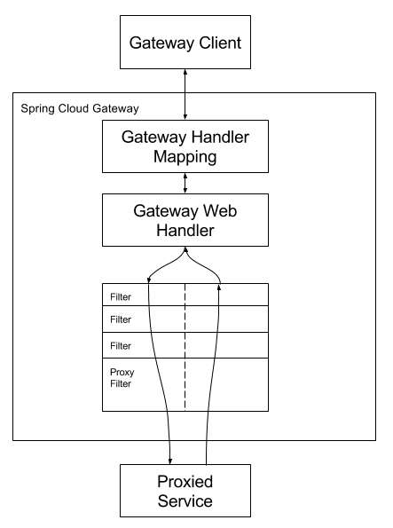

# SpringCloud:

## 微服务概述

1、什么是微服务

- 目前的微服务并没有一个统一的标准，一般是以业务来划分
- 将传统的一站式应用，拆分成一个个的服务，彻底去耦合，一个微服务就是单功能业务，只做一件事。
- 与微服务相对的叫巨石

2、微服务与微服务架构

- 微服务是一种架构模式或者一种架构风格，提倡将单一应用程序划分成一组小的服务独立部署，服务之间相互配合、相互协调，每个服务运行于自己的进程中。
- 服务与服务间采用轻量级通讯，如HTTP的RESTful API等
- 避免统一的、集中式的服务管理机制

3、 微服务的优缺点

优点

1. 每个服务足够内聚，足够小，比较容易聚焦
2. 开发简单且效率高，一个服务只做一件事情
3. 开发团队小，一般2-5人足以（当然按实际为准）
4. 微服务是松耦合的，无论开发还是部署都可以独立完成
5. 微服务能用不同的语言开发
6. 易于和第三方集成，微服务允许容易且灵活的自动集成部署（持续集成工具有Jenkins,Hudson,bamboo等）
7. 微服务易于被开发人员理解，修改和维护，这样可以使小团队更加关注自己的工作成果，而无需一定要通过合作才能体现价值
8. 微服务允许你融合最新的技术
9. 微服务只是业务逻辑的代码，不会和HTML,CSS或其他界面组件融合。
10. 每个微服务都可以有自己的存储能力，数据库可自有也可以统一，十分灵活。

缺点

1. 开发人员要处理分布式系统的复杂性
2. 多服务运维难度，随着服务的增加，运维的压力也会增大
3. 依赖系统部署
4. 服务间通讯的成本
5. 数据的一致性
6. 系统集成测试
7. 性能监控的难度

##  SpringCloud概述

spring的三大模块：SpringBoot（构建），Spring Cloud（协调），Spring Cloud Data Flow（连接）

1、SpringCloud是什么

- 分布式系统的简化版（官方介绍）
- SpringCloud基于SpringBoot提供了一整套微服务的解决方案，包括服务注册与发现，配置中心，全链路监控，服务网关，负载均衡，熔断器等组件，除了基于Netflix的开源组件做高度抽象封装之外，还有一些选型中立的开源组件
- SpringCloud利用SpringBoot的开发便利性巧妙地简化了分布式系统的基础设施开发，SpringCloud为开发人员提供了快速构建分布式系统的一些工具，包括配置管理、服务发现、断路器、路由、微代理、事件总线，全局所、决策精选、分布式会话等等，他们都可以用SpringBoot的开发风格做到一键启动和部署。
- 一句话概括：SpringCloud是分布式微服务架构下的一站式解决方案，是各个微服务架构落地技术的几何体，俗称微服务全家桶

2、SpringCloud和SpringBoot的关系：

- SpringBoot：专注于快速方便的开发单个个体微服务（关注微观）

- SpringCloud：关注全局的微服务协调治理框架，将SpringBoot开发的一个个单体微服务组合并管理起来（关注宏观）


## 1、服务注册与发现

### 1、Eureka

####  介绍

- Eureka是一个基于REST的服务，用于定位服务，以实现云端中间层服务发现和故障转移。
- Eureka主管服务注册与发现，在微服务中，以后了这两者，只需要使用服务的标识符（就是那个在每个服务的yml文件中取得服务名称），就可以访问到服务，不需要修改服务调用的配置文件
- Eureka遵循AP原则（高可用，分区容错性），因为使用了自我保护机制所以保证了高可用

#### 原理

- Eureka使用的是C-S结构（客户端-服务端）
- 两大组件：Eureka Server（提供注册服务）、Eureka Client（JAVA客户端，负责发送心跳）
- 系统中的其他微服务使用Eureka客户端连接到Eureka服务端维持心跳连接（即注册）。SpringCloud的其他模块可以通过Eureka Server 来发现系统中的微服务并加以调用

#### 自我保护机制

介绍：Eureka的自我保护机制主要是为了网络异常时保持高可用设计的，当在Eureka中注册的微服务超过设定是时间内（默认90秒）没有向Eureka服务端发送心跳，该微服务会进入自我保护模式。在自我保护模式中，Eureka会保护服务注册表中的信息，不会注销任何服务实例，直至收到的心跳数恢复至阈值以上，该微服务退出自我保护模式。

理解：好死不如赖活：Eureka的设计哲学是宁可保留错误的服务信息，也不盲目注销可能健康的服务。所以异常的服务不会被注销，而是进入了自我保护模式。

```yaml
eureka:
  server:
    #关闭自我保护机制，保证不可用服务被及时踢除
    enable-self-preservation: false
    # 剔除时间间隔
    eviction-interval-timer-in-ms: 2000
```


### 2、Zookeeper

### 3、Consul

### 4、异同

## 2、服务调用

## 3、服务熔断/降级

一次调用失败为降级，多级调用失败熔断

## 4、服务网关

[官网](https://spring.io/projects/spring-cloud-gateway)

### 1.概述

SpringCloud Gateway使用的是Webflux中的reactor-netty响应式编程组件,底层使用了Netty通讯框架。

#### 1.1 特性

- 动态路由：能够匹配任何请求属性
-  Predicate（断言）和 Filter（过滤器）
- 集成Hystrix的断路器功能
- 集成 Spring Cloud 服务发现功能
- 请求限流功能
- 支持路径重写

#### 1.2 三大核心概念

**Route(路由)**

路由是构建网关的基本模块，它由ID，目标URI，一系列的断言和过滤器组成，如果断言为true则匹配该路由

**Predicate(断言)**

参考的是Java8的java.util.function.Predicate，开发人员可以匹配HTTP请求中的所有内容(例如请求头或请求参数)，如果请求与断言相匹配则进行路由

**Filter(过滤)**

指的是Spring框架中GatewayFilter的实例，使用过滤器，可以在请求被路由前或者之后对请求进行修改。


### 2.工作流程



> Clients make requests to Spring Cloud Gateway. If the Gateway Handler Mapping determines that a request matches a route, it is sent to the Gateway Web Handler. This handler runs the request through a filter chain that is specific to the request. The reason the filters are divided by the dotted line is that filters can run logic both before and after the proxy request is sent. All “pre” filter logic is executed. Then the proxy request is made. After the proxy request is made, the “post” filter logic is run.

客户端向 Spring Cloud Gateway 发出请求。然后在 Gateway Handler Mapping 中找到与请求相匹配的路由，将其发送到 Gateway Web Handler。

### 4.配置

#### 4.1 pom

```xml
<dependencies>
        <!--gateway-->
        <dependency>
            <groupId>org.springframework.cloud</groupId>
            <artifactId>spring-cloud-starter-gateway</artifactId>
        </dependency>
        <!--eureka-client-->
        <dependency>
            <groupId>org.springframework.cloud</groupId>
            <artifactId>spring-cloud-starter-netflix-eureka-client</artifactId>
        </dependency>
</dependencies>
```


#### 4.2 yaml 配置方式

```yaml
server:
  port: 9527

spring:
  application:
    name: cloud-gateway
  cloud:
    gateway:
      discovery:
        locator:
          enabled: true #开启从注册中心动态创建路由的功能，利用微服务名进行路由
      routes:
        - id: payment_routh #payment_route    #路由的ID，没有固定规则但要求唯一，建议配合服务名
          #uri: http://localhost:8001          #匹配后提供服务的路由地址
          uri: lb://cloud-payment-service #匹配后提供服务的路由地址
          predicates:
            - Path=/payment/get/**         # 断言，路径相匹配的进行路由
            - After=2022-08-10T13:45:24.311+08:00[Asia/Shanghai]

        - id: payment_routh2 #payment_route    #路由的ID，没有固定规则但要求唯一，建议配合服务名
          #uri: http://localhost:8001          #匹配后提供服务的路由地址
          uri: lb://cloud-payment-service #匹配后提供服务的路由地址
          predicates:
            - Path=/payment/lb/**         # 断言，路径相匹配的进行路由
            - After=2022-08-10T13:45:24.311+08:00[Asia/Shanghai]
            # - Before=2022-08-10T14:45:24.311+08:00[Asia/Shanghai]
            # - Between=2022-08-10T14:45:24.311+08:00[Asia/Shanghai] ,  2022-08-10T14:45:24.311+08:00[Asia/Shanghai]
            # - Cookie=username,zzyy   #Cookie=cookieName,正则表达式
            # - 请求头要有X-Request-Id属性并且值为整数的正则表达式 curl http://localhost:9527/payment/lb --cookie "username=zzyy" -H "X-Request-Id:11"
            # - Header=X-Request-Id, \d+
            # - Host=**.atguigu.com  # curl http://localhost:9527/payment/lb -H "Host:afae.atguigu.com"

eureka:
  instance:
    hostname: cloud-gateway-service
  client: #服务提供者provider注册进eureka服务列表内
    service-url:
      register-with-eureka: true
      fetch-registry: true
      defaultZone: http://eureka7001.com:7001/eureka,http://eureka7002.com:7002/eureka
      #defaultZone: http://eureka7001.com:7001/eureka
```

#### 4.4 主启动类

```java
@SpringBootApplication
@EnableEurekaClient
public class GateWayMain9527 {
    public static void main(String[] args) {
        SpringApplication.run(GateWayMain9527.class, args);
    }
}

```


#### 4.3 代码配置方式

```java
@Configuration
public class GateWayConfig {
    @Bean
    public RouteLocator customRouteLocator(RouteLocatorBuilder routeLocatorBuilder) {
        RouteLocatorBuilder.Builder routes = routeLocatorBuilder.routes();
        routes.route("path_route_atguigu", r -> r.path("/guoji").uri("http://news.baidu.com/guonei"))
                .build();
        return routes.build();
    }
}
```

官网案例：

```java
//https://spring.io/projects/spring-cloud-gateway#overview
@SpringBootApplication
public class DemogatewayApplication {
	@Bean
	public RouteLocator customRouteLocator(RouteLocatorBuilder builder) {
		return builder.routes()
			.route("path_route", r -> r.path("/get")
				.uri("http://httpbin.org"))
			.route("host_route", r -> r.host("*.myhost.org")
				.uri("http://httpbin.org"))
			.route("rewrite_route", r -> r.host("*.rewrite.org")
				.filters(f -> f.rewritePath("/foo/(?<segment>.*)", "/${segment}"))
				.uri("http://httpbin.org"))
			.route("hystrix_route", r -> r.host("*.hystrix.org")
				.filters(f -> f.hystrix(c -> c.setName("slowcmd")))
				.uri("http://httpbin.org"))
			.route("hystrix_fallback_route", r -> r.host("*.hystrixfallback.org")
				.filters(f -> f.hystrix(c -> c.setName("slowcmd").setFallbackUri("forward:/hystrixfallback")))
				.uri("http://httpbin.org"))
			.route("limit_route", r -> r
				.host("*.limited.org").and().path("/anything/**")
				.filters(f -> f.requestRateLimiter(c -> c.setRateLimiter(redisRateLimiter())))
				.uri("http://httpbin.org"))
			.build();
	}
}
```


## 5、服务配置&服务总线

## 6、Stream消息驱动/Sleuth分布式请求链路跟踪

## 7、Nacos服务注册和配置中心

## 8、Sentinel实现熔断与限流

## 9、Seata处理分布式事务